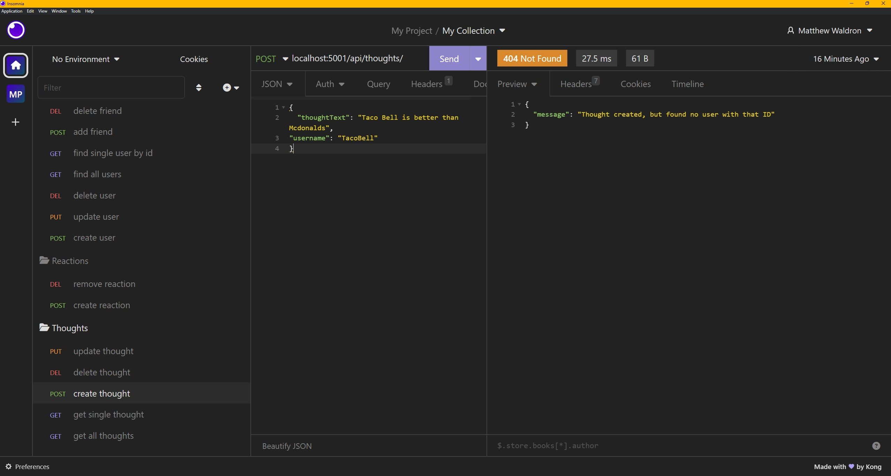

# NoSQL Challenge: Social Network API Challenge-18

## Description

Your challenge is to build an API for a social network web application where users can share their thoughts, react to friends’ thoughts, and create a friend list. You’ll use Express.js for routing, a MongoDB database, and the Mongoose ODM.

## Table of Contents

1. [Installation](#installation)
2. [Usage](#usage)
3. [Screenshots](#screenshots)
4. [Credits](#credits)
5. [Tests](#tests)
6. [License](#license)
7. [Questions](#questions)

## Installation

npm i express "^4.17.1"  
 npm i mongoose "^6.0.13"  
 npm i mongodb "^4.5.0"  
 npm i "nodemon": "^2.0.9"

## Usage

scripts:
"start": "node index", 
"dev": "nodemon index", 
"seed": "node utils/seed" 

Make sure to have insomnia or something similar installed:

THOUGHTS:

localhost:5001/api/thoughts - shows all thoughts made by users (get) 
localhost:5001/api/thoughts/63c4a3a50cb775b7b4f10a18 - shows thought made by user (get) 
localhost:5001/api/thoughts - create a thought (post) 
localhost:5001/api/thoughts/63c4a3a50cb775b7b4f10a18 - deletes a thought (delete) 
localhost:5001/api/thoughts/63c5e89e183665bee8353e10 - updates a thought (put) 

USERS:

localhost:5001/api/users - Shows all users (get) 
localhost:5001/api/users/63c4a32d0cb775b7b4f10a10 - shows user by id (get) 
localhost:5001/api/users - create a user (post) 
localhost:5001/api/users/63c4a32d0cb775b7b4f10a10 - Deletes a user (delete) 
localhost:5001/api/users/63c49c60f8489141a41d2097 - updates a user (put) 

#Link to Demo
https://drive.google.com/file/d/1KEW4C0FL4nZBLykrCV9waQ3B86-VYmyP/view

## Screenshots

All Thoughts:

Single Thought:

Create a thought:

Delete a thought:

Update a thought:

All Users:

Single User:

Create a user:

Delete a user:

Updates a User:

## Tests

N/A

## License

Licensed under the [MIT license](https://choosealicense.com/licenses/mit/)

## Questions

- GitHub: https://github.com/mrartrager/NoSQL-Challenge-Social-Network-API
- Email: matthew.d.waldron@gmail.com
